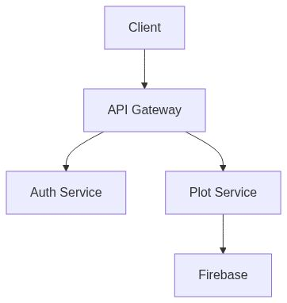
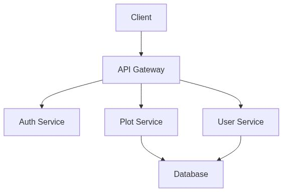
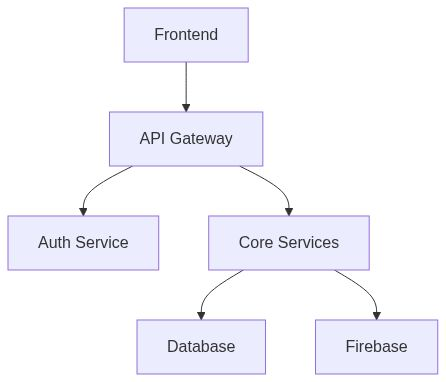
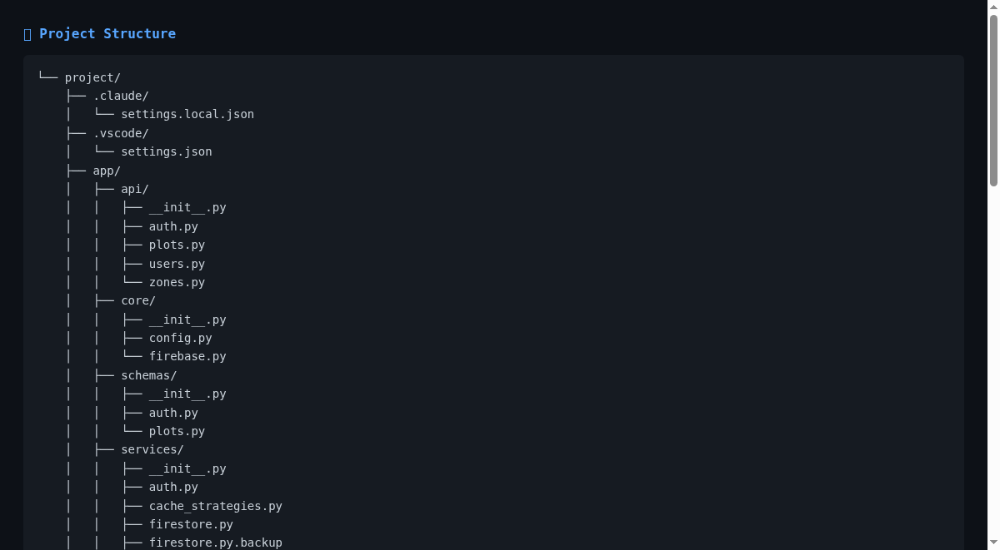
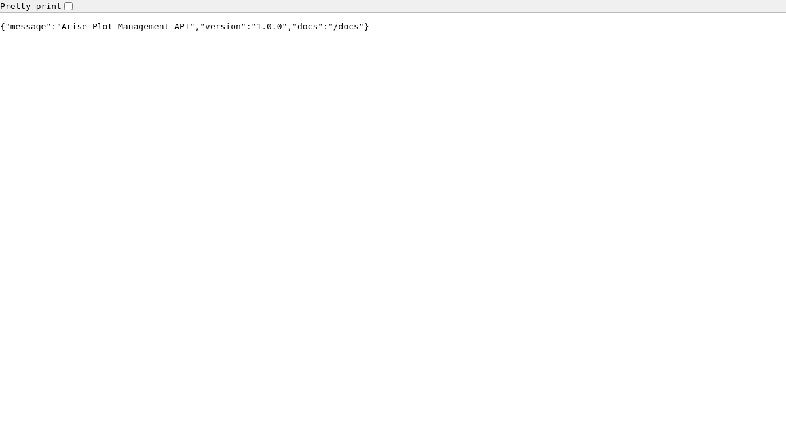
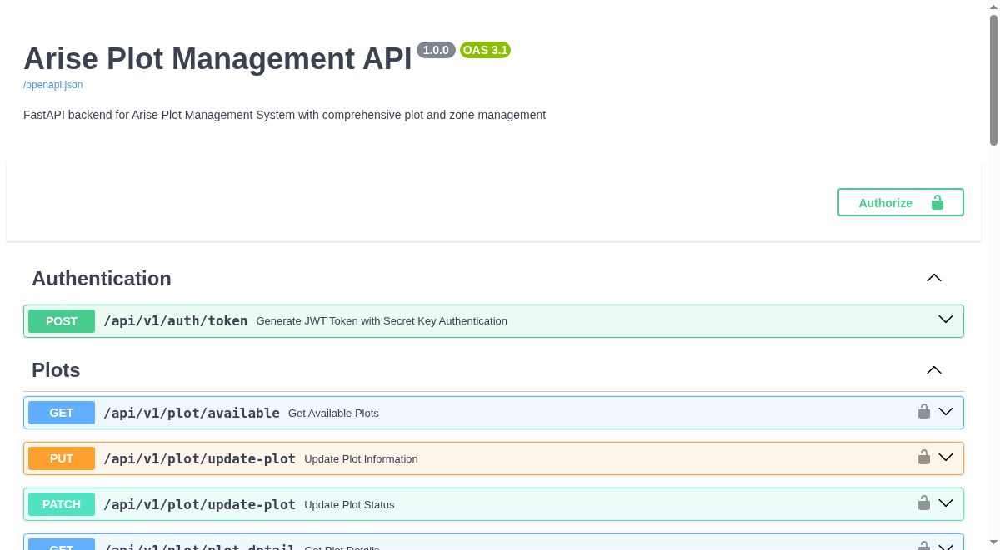

# AI-Powered Documentation Generator

**Version:** 1.2.6
**Status:** Production Ready
**License:** MIT

> Documentation (docx, pdf) generator (using Codebase, Live Site, etc.) from Repomix (context) file, Gemini API key and the Live app URLs. Containerized (Dockerize) for running smoothly (easy setup, configuration) with necessary Env variable info fed into the docker-compose.yml or .env. Also integrates Diagrams (data flow, design flow, etc), Images.

## Overview

An autonomous, Docker-based documentation generator that analyzes your codebase and produces professional Word (.docx) and PDF documentation with:

- **AI-Powered Content**: Intelligent section generation using Google Gemini 2.5 Flash-Lite
- **Visual Documentation**: Automated screenshots of code and live applications
- **Architecture Diagrams**: Mermaid diagram generation for system visualization
- **Multiple Formats**: Export to DOCX and PDF
- **Zero Configuration**: Fully containerized with Docker Compose

## Generated Visuals & Examples

### Architecture & Design
The tool automatically generates Mermaid diagrams to visualize your project's structure and flow.


*Project Overview Diagram*


*Architecture & Design Diagram*


*Core Components Diagram*

### Automated Screenshots
Captures key parts of your codebase and live application interfaces.


*Project Directory Structure*


*Live Application Home Page*


*Automated API Documentation Screenshot*

### Output Examples
Download example documentation generated by this tool:
- [📄 Documentation (PDF)](output/documentation.pdf)
- [📝 Documentation (DOCX)](output/documentation.docx)

## Key Features

### Core Capabilities
- **Multi-Agent Architecture**:
  - `GeminiDocAgent`: AI content generation and planning
  - `ScreenshotAgent`: Automated code and application screenshots
  - `MermaidAgent`: Architecture diagram generation
  - `DocumentAssembler`: Professional document formatting with TOC and hyperlinks

- **Smart Rate Limiting**: Configured for Gemini 2.5 Flash-Lite free tier (15 RPM)
- **Comprehensive Documentation**: 9-15 sections based on project complexity
- **Live App Screenshots**: Capture running application interfaces
- **Cross-Platform PDF Export**: LibreOffice-based conversion

### Recent Updates (v1.2.6)
- Table of Contents with automatic numbering
- Clickable hyperlinks to external resources
- Contributors and metadata support
- Improved Mermaid diagram rendering
- Enhanced ChromeDriver compatibility

## Quick Start

### Prerequisites
- Docker and Docker Compose
- Google Gemini API key (free tier: https://aistudio.google.com/apikey)

### 1. Run with Docker Compose (Recommended)

All configuration is in `docker-compose.yml` - no separate `.env` file needed:

```bash
# 1. Clone the repository
git clone <repo-url>
cd documentation_generator

# 2. Edit docker-compose.yml and set:
#    - GEMINI_API_KEY=your_actual_api_key
#    - PROJECT_PATH=/path/to/your/project (in volumes section)
#    - PROJECT_NAME=Your Project Name
#    - LIVE_APP_URL=http://your-app-url (optional)

# 3. Run the generator
docker-compose up

# 4. Find output in ./output/documentation.docx
```

The container will:
- Load configuration from `docker-compose.yml`
- Mount your project as read-only at `/app/project`
- Generate documentation to `./output/`
- Save screenshots to `./screenshots/`
- Save diagrams to `./mermaid_diagrams/`
- Exit automatically when complete

### 2. Run Without Docker (Development)

```bash
# 1. Create virtual environment
python3 -m venv venv
source venv/bin/activate  # On Windows: venv\Scripts\activate

# 2. Install dependencies
pip install -r requirements.txt

# 3. Install system dependencies
# Ubuntu/Debian:
sudo apt install chromium chromium-driver libreoffice-writer
npm install -g @mermaid-js/mermaid-cli

# 4. Create .env file (copy from docker-compose.yml environment section)
cp .env.example .env
# Edit .env with your API key and settings

# 5. Run
python run_doc_generator.py
```

## Configuration

### Key Settings in docker-compose.yml

```yaml
environment:
  # API Configuration
  GEMINI_API_KEY: your_api_key_here
  GEMINI_MODEL: gemini-2.5-flash-lite  # Free tier: 15 RPM, 1000 req/day

  # Project Configuration
  PROJECT_NAME: "Your Project Name"
  PROJECT_PATH: /app/project  # Mapped from volumes
  PROJECT_DESCRIPTION: "Brief description"

  # Rate Limiting (optimized for free tier)
  GEMINI_REQUEST_DELAY: 5  # 5s = 12 req/min (under 15 RPM limit)
  GEMINI_MAX_REQUESTS_PER_MINUTE: 15

  # Screenshot Configuration
  ENABLE_SCREENSHOTS: true
  BROWSER_CHOICE: chrome  # Uses Chromium in Docker
  MAX_SCREENSHOTS_PER_DOCUMENT: 8

  # Diagram Configuration
  ENABLE_MERMAID_DIAGRAMS: true
  MAX_MERMAID_DIAGRAMS: 3

  # PDF Export
  ENABLE_PDF_EXPORT: true

  # Optional: Repomix for better context
  USE_REPOMIX: true
  REPOMIX_FILE_PATH: /app/project/repomix-output.xml
```

### Why Gemini 2.5 Flash-Lite?

This model is chosen specifically for the **free tier limits**:
- **Rate Limits**: 15 requests per minute (RPM)
- **Daily Limit**: 1,000 requests per day
- **Throughput**: 250K tokens/minute

With `GEMINI_REQUEST_DELAY=5` seconds:
- **12 requests/minute** (80% utilization)
- Safely stays under the 15 RPM limit
- Prevents rate limit errors

## Architecture

### Agent System

```
┌─────────────────────────────┐
│  DocumentationGenerator     │
│   (Main Orchestrator)       │
└──────────┬──────────────────┘
           │
     ┌─────┴─────┬─────────────┐
     │           │             │
     v           v             v
┌──────────┐ ┌──────────┐ ┌──────────┐
│ Gemini   │ │Screenshot│ │ Mermaid  │
│DocAgent  │ │  Agent   │ │  Agent   │
│(Content) │ │(Selenium)│ │(Diagrams)│
└──────────┘ └────┬─────┘ └────┬─────┘
                  │             │
                  v             v
             ┌─────────┐   ┌─────────┐
             │Chromium │   │Puppeteer│
             │ Browser │   │ (mmdc)  │
             └─────────┘   └─────────┘
                  │             │
                  └──────┬──────┘
                         v
                  ┌─────────────┐
                  │  Document   │
                  │  Assembler  │
                  │ (DOCX+PDF)  │
                  └─────────────┘
```

## Project Structure

```
documentation_generator/
├── doc_generator.py           # Main generator with all agents
├── run_doc_generator.py       # Wrapper script with validation
├── requirements.txt           # Python dependencies
├── Dockerfile                 # Container image definition
├── docker-compose.yml         # Complete configuration
├── docker-entrypoint.sh       # Container initialization
│
├── output/                    # Generated documentation
├── screenshots/               # Captured screenshots
├── mermaid_diagrams/          # Generated diagrams
│
└── Documentation:
    ├── README.md              # This file
    ├── IMPLEMENTATION_STATUS.md  # Feature status
    ├── FEATURES_v1.2.5.md     # Latest features
    ├── BUILD.md               # Build instructions
    ├── DOCKER_SETUP.md        # Docker details
    └── CHANGELOG.md           # Version history
```

## Repomix Integration

For best results, generate a repomix file before running:

```bash
# Install repomix (if not already installed)
npm install -g repomix

# Generate context file
repomix /path/to/your/project -o repomix-output.xml

# Place in project root or specify path in docker-compose.yml
```

**Benefits**:
- Better AI understanding of codebase
- Faster context loading
- Respects .gitignore automatically

Set in `docker-compose.yml`:
```yaml
USE_REPOMIX: true
REPOMIX_FILE_PATH: /app/project/repomix-output.xml
```

## Troubleshooting

See [DOCKER_SETUP.md](DOCKER_SETUP.md) for detailed troubleshooting or check `docker-compose logs`.

## Contributing

See [CONTRIBUTING.md](CONTRIBUTING.md) for code style guidelines and development workflow.

## License

MIT License - see LICENSE file


